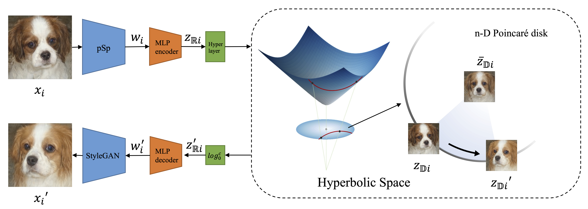

# The Euclidean Space is Evil: Hyperbolic Attribute Editing for Few-shot Image Generation (ICCV 2023)
<a href="https://arxiv.org/abs/2211.12347"></a>
<a href="https://opensource.org/licenses/MIT"></a>  


Few-shot image generation is a challenging task since it aims to generate diverse new images for an unseen category with only a few images. Existing methods suffer from the trade-off between the quality and diversity of generated images. To tackle this problem, we propose Hyperbolic Attribute Editing (HAE), a simple yet effective method. Unlike other methods that work in Euclidean space, HAE captures the hierarchy among images using data from seen categories in hyperbolic space. Given a well-trained HAE, images of unseen categories can be generated by moving the latent code of a given image toward any meaningful directions in the Poincaré disk with a fixing radius. Most importantly, the hyperbolic space allows us to control the semantic diversity of the generated images by setting different radii in the disk. Extensive experiments and visualizations demonstrate that HAE is capable of not only generating images with promising quality and diversity using limited data but achieving a highly controllable and interpretable editing process.



## Description   
Official implementation of HAE for few-shot image generation. Our code is modified from [pSp](https://github.com/eladrich/pixel2style2pixel.git).

## Getting Started
### Prerequisites
- Linux
- NVIDIA GPU + CUDA CuDNN (CPU may be possible with some modifications, but is not inherently supported)
- Python 3

### Installation

- Clone this repo:  
``` 
git clone https://github.com/lingxiao-li/HAE.git
cd HAE
```

- Dependencies:  
We recommend running this repository using [Anaconda](https://docs.anaconda.com/anaconda/install/). 
All dependencies for defining the environment are provided in `/HAE/hae/environment/hae_env.yaml`.


### Pre-trained Models
Then download the pre-trained models we provide from [Google Drive](https://drive.google.com/drive/folders/18zMfAEjd4JLsjQM78ky2GmHsolV7OJ_x?usp=share_link)

Then put the pre-trained models under `/HAE/hae/pretrained_models`


## Training
### Preparing your Data
Related datasets can be downloaded at:
https://github.com/bcmi/Awesome-Few-Shot-Image-Generation

After downloading the pre-trained models and datasets, change the corresponding path
at `/Codes/hae/configs/paths_config.py`

### Train
Go to the path to HAE:

``` cd /PATH_TO/HAE/hae``` 


Then you can train the model using:
``` 
python scripts/train.py \
--dataset_type=flowers_encode_eva \
--psp_checkpoint_path=/PATH_TO/psp_flowers.pt \
--exp_dir=OUTPUT_PATH \
--feature_size=512 \
--workers=8 \
--batch_size=8 \
--test_batch_size=8 \
--test_workers=8 \
--val_interval=80000 \
--save_interval=5000 \
--encoder_type=GradualStyleEncoder \
--start_from_latent_avg \
--lpips_lambda=1 \
--l2_lambda=1 \
--image_interval=1000 \
--hyperbolic_lambda=0.3 \
--reverse_lambda=1
``` 
### Inference
Inference the images using:
``` 
python scripts/inference.py \
--exp_dir=OUTPUT_PATH \
--checkpoint_path=/PATH_TO/hae_flowers.pt \
--data_path=PATH_TO/flowers_eva/test \
--test_batch_size=4 \
--test_workers=4
```


## Visualization

Please see the comments in the notebook:

`Interpolation & Perturbation.ipynb`
and
`UMAP_Visualization.ipynb`


## Citation
If you use this code for your research, please cite our paper <a href="https://arxiv.org/abs/2211.12347">The Euclidean Space is Evil: Hyperbolic Attribute Editing for Few-shot Image Generation</a>:

```
@InProceedings{Li_2023_HAE,
    author    = {Li, Lingxiao and Zhang, Yi and Wang, Shuhui},
    title     = {The Euclidean Space is Evil: Hyperbolic Attribute Editing for Few-shot Image Generation},
    booktitle = {Proceedings of the IEEE/CVF International Conference on Computer Vision (ICCV)},
    month     = {October},
    year      = {2023},
    pages     = {22714-22724}
}
```
